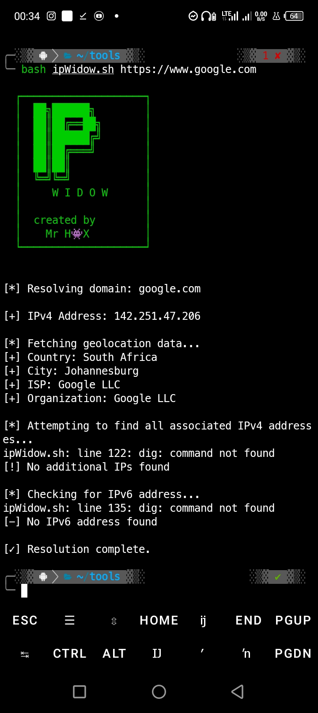

# 🕷️ IP Widow - Domain to IP Hunter

**IP Widow** is a lightweight, fast, and responsive bash tool that hunts down server IP addresses from any domain or URL. Perfect for system administrators, network analysts, and cybersecurity enthusiasts.

## ✨ Features

- 🎯 Extract IPv4 and IPv6 addresses
- 🌍 Geolocation data (country, city, ISP)
- 🔄 Reverse DNS lookup
- 📊 Shows all associated IPs (load balancers/CDNs)
- 📱 Responsive banner (works on Android & laptops)
- 🟢 Green ASCII banner with "created by Mr H👾X"
- ⚡ Multiple DNS resolution methods (dig, host, nslookup, ping)

┌────────────────────┐
│  ██╗██████╗        │
│  ██║██╔══██╗       │
│  ██║██████╔╝       │
│  ██║██╔═══╝        │
│  ██║██║            │
│  ╚═╝╚═╝            │
│     W I D O W      │
│                    │
│  created by        │
│    Mr H👾X         │
└────────────────────┘

## 📸 Screenshots

### Android Termux
 

## 🚀 Installation

### Linux / Termux (Android)

git clone https://github.com/sikasiye/IP-Widow.git

cd IP-Widow

chmod +x ipwidow.sh

./ipwidow.sh example.com

## 👨‍💻 Author

**Mr H👾X**

| Platform | Link |
|----------|------|
| Email | sikasiyekelvin02@gmail.com |

## 🙏 Credits

- **Creator**: Mr H👾X
- **Contributors**: None yet (be the first!)
- **Inspiration**: Open source security tools

## 📞 Support

- Open an issue on GitHub
- Contact author directly via email

## 📄 License

GNU License - See [LICENSE](LICENSE) file

Copyright (c) 2025 Mr H👾X
